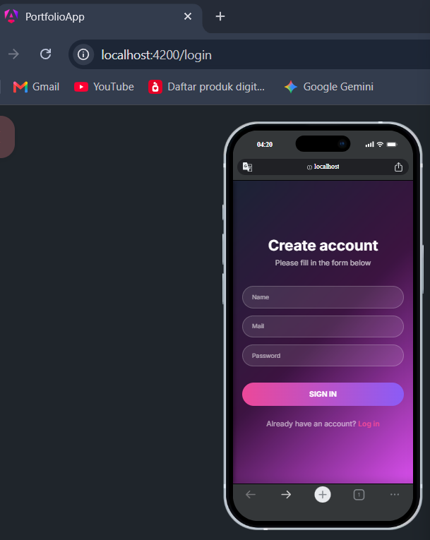
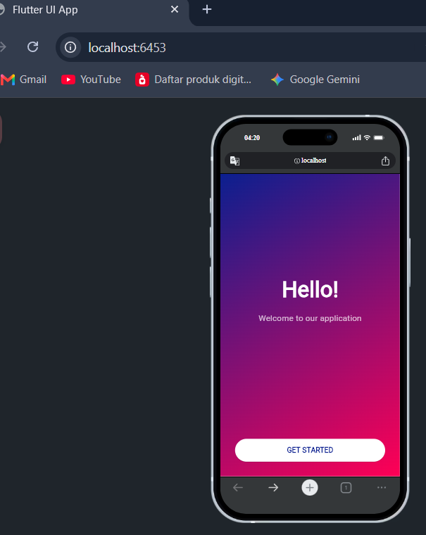

# 🚀 Frontend UI Showdown: Angular vs Flutter!

Halo semuanya! 👋 Selamat datang di *repository* eksperimen seru ini. Di sini, gue  nyoba ngebangun satu desain UI yang sama persis, tapi pakai dua "senjata" yang beda: **Angular** dan **Flutter**.

Tujuan utamanya simpel: pengen ngebuktiin gimana sih rasanya *slicing* UI yang sama di ekosistem Web (Angular) vs Cross-platform (Flutter). Kita bakal bahas blak-blakan soal performa, seberapa ribet belajarnya, sampai urusan *security*. Cocok banget buat kalian yang lagi galau mau milih *stack* frontend!

> **Catatan Penting:** File SDK Flutter/Angular sengaja **enggak di-upload** ke sini ya, *guys*. Soalnya ukurannya jumbo banget (~1.7GB+ buat Flutter), dan nge-push file segede gaban ke GitHub itu agak *red flag* 😅. Tenang aja, panduan *setup* SDK-nya udah gue siapin di bawah.

---

## 📸 UI Gallery: Slicing Result

Biar nggak penasaran, ini dia perbandingan *side-by-side* dari desain asli (Mockup) vs hasil *codingan* kita di Angular dan Flutter.

*(Buat yang mau nge-clone, pastiin kalian masukin gambar `design.png`, `angular.png`, dan `flutter.png` ke folder `assets/` biar gambarnya muncul di sini ya!)*

| Desain Awal (Mockup) | Hasil (Angular) | Hasil (Flutter) |
|:---:|:---:|:---:|
|  |  |  |

**Verdict:** Dua-duanya sukses ngasih hasil yang 100% *pixel-perfect* dan super responsif di layar *mobile* (lebar di bawah 480px). Jadi kalau soal tampilan visual, dua-duanya juara! 🏆

---

## ⚙️ Apa Sih Bedanya Waktu Dijalanin? (Under the Hood)

Secara kasat mata mungkin mirip, tapi "mesin" di baliknya beda jauh, bro:

| Kategori | Angular (Web) | Flutter (Cross-platform) |
| --- | --- | --- |
| **Engine Render** | Mainnya di area DOM (Document Object Model) standar. Browser (kayak Chrome/Safari) yang langsung kerja keras nge-render HTML/CSS kita. | Punya "tukang gambar" sendiri namanya Skia (atau Impeller). Dia ngegambar setiap pixel di layar secara mandiri, nggak peduli browsernya apa. |
| **Hasil Build** | Kodenya di-compile jadi HTML, CSS, dan Javascript murni. | Kodenya jadi biner *native* (buat HP/Desktop) atau WebAssembly (WASM) kalau dijalanin di Web. |
| **Cara Styling** | Enak banget buat yang suka *styling* pakai CSS/SCSS terpisah. Bebas banget ngutak-ngatik layout. | Semuanya berbasis Widget. Nggak ada file CSS terpisah, *styling*-nya disuntik langsung ke dalam kode Dart-nya. |
| **Responsivitas** | Tinggal mainin `@media query` atau Flexbox/Grid di CSS. Sangat familiar buat Web Dev. | Pake logika *layouting* bawaan Dart (kayak `MediaQuery` atau `LayoutBuilder`). Agak beda *mindset*-nya dari CSS. |

---

## ⚡ Ngomongin Performa (Kecepatan & Responsivitas)

Kalau kita bahas performa di dunia nyata (terutama di platform Web):

- **Waktu Muat Awal (Time-to-Interactive):**
  - **Angular:** *Wusss!* 🚀 Rata-rata cuma butuh **50 - 200 ms**. Wajar sih, karena *output*-nya murni Javascript yang emang bahasa aslinya browser.
  - **Flutter (di Web):** Agak *slow-start* (rata-rata **500 - 1500 ms**). Soalnya browser harus nge-load *engine* Flutter-nya (CanvasKit/WASM) dulu sebelum bisa nampilin UI. *Eits*, tapi kalau dijadiin aplikasi HP (APK/iOS), Flutter ini instan banget!

- **Smoothness (FPS Animasi):**
  - Dua-duanya gampang banget nembus **60 sampai 120 FPS**. Animasi kerasa mulus banget selama kita nggak naro proses *logic* yang berat-berat di *Main Thread*.

---

## 🔒 Gimana Soal Keamanan (Security)?

| Framework | Tingkat Keamanan & Skenario |
| --- | --- |
| **Angular** | **Aman buat standar Web.** Udah ada fitur *DOM Sanitizer* bawaan buat nangkis serangan XSS. Tapi inget, karena *output*-nya JS murni, kodenya gampang di-inspect orang. Jadi jangan pernah nyimpen rahasia (API Keys) di sini! |
| **Flutter** | **Susah Ditembus (Anti Reverse-Engineering).** Karena kodenya nggak jadi HTML biasa melainkan jadi *Canvas* atau WASM, *hacker* iseng nggak bakal bisa gampang klik kanan -> Inspect Element buat ngacak-ngacak UI atau nyuntikin kode sembarangan. |

---

## 🧠 Seberapa Susah Sih Belajarnya? (Learning Curve)

Ini dia *rating* jujur tingkat kesulitan buat kalian yang mau nyemplung, mulai dari yang baru belajar sampai yang udah sepuh:

### 🐣 Level Pemula (Beginner)
Kalian yang baru pertama kali megang *framework* frontend.
- **Angular (Tantangan Berat 🤯):** Terasa cukup susah. Kalian bakal langsung dihajar sama konsep Typescript, *Dependency Injection*, sampai RxJS (Observables). Bahasanya agak kaku dan peraturannya banyak. Butuh waktu buat membiasakan diri.
- **Flutter (Lumayan Asik 🤔):** Sedikit lebih santai. Konsep "Semuanya itu Widget" bikin gampang ngebayangin UI kayak main lego. Tapi, pas *tree* (pohon) widget-nya udah mulai dalem, biasanya pemula suka pusing bacanya.

### 👦 Level Junior
Kalian yang udah paham dasar-dasar ngoding dan mau bikin aplikasi utuh.
- **Angular (Lagi Berjuang 🧗):** Butuh sekitar 1-2 bulan buat bener-bener "klik" sama cara kerja *state management* dan siklus hidup (lifecycle) komponennya.
- **Flutter (Seru Banget 🎢):** Bikin UI cepet banget! Tantangannya muncul pas kalian mulai disuruh milih *State Management* (mau pake Provider, Bloc, atau Riverpod ya?).

### 👨‍💻 Level Mid
Kalian yang udah punya jam terbang dan ngerti *best practice*.
- **Angular (Mulai Nyaman 🛋️):** Bakal ngerasa produktif banget. Konsep OOP dan *Service* di Angular bikin kode kalian rapi secara otomatis.
- **Flutter (Ngebut 🏎️):** Ngerender *pixel-perfect* UI dan nyambungin ke API backend rasanya udah kayak napas biasa. Cepat dan presisi.

### 🧙‍♂️ Level Senior / Sepuh
Kalian yang mikirin skalabilitas, *maintenance*, dan arsitektur kelas kakap.
- **Angular (Super Cepat ⚡):** Aturan ketat Angular yang tadinya bikin susah pemula, justru jadi penyelamat di level ini. Ngebangun aplikasi gede skala *Enterprise* jadi aman banget karena strukturnya udah pasti seragam.
- **Flutter (Satu Untuk Semua 🌍):** Efisiensi tingkat dewa. Dengan arsitektur yang sama, kalian bisa rilis aplikasi ke Web, iOS, dan Android sekaligus pakai 1 *codebase*.

**Estimasi Waktu Belajar Dasar (UI, State, Routing):**
- **Angular:** Sekitar 4 - 6 Minggu kalau difokusin.
- **Flutter:** Lebih cepet, sekitar 2 - 4 Minggu.

---

## 🛠️ Panduan Install & Melanjutkan Pengembangan (Local Setup)

Pengen nerusin desainnya atau nyoba nge-run sendiri di laptop kalian? Gampang! Siapin dulu "perkakas" ini ya:

### 1. Buat Tim Angular (`Angular_Framework`)
**Apa aja yang disiapin?**
- Wajib install **Node.js** (Minimal versi 18+).
- Install alat tempurnya (Angular CLI) via terminal: `npm install -g @angular/cli`.
- Editor keren (VS Code sangat disarankan).

**Cara Nge-run:**
1. Masuk ke foldernya: `cd Angular_Framework/portfolio-app`
2. Tarik semua *dependencies*: `npm install`
3. Nyalain server lokalnya: `ng serve`
4. Buka browser dan ketik: `http://localhost:4200/`

**Kalau mau ngelanjutin desain:** Kalian tinggal buka file `.html` dan `.css` di dalam folder `src/app/`. Kalau mau nambah halaman baru, tinggal ketik `ng generate component nama_halaman` di terminal.

---

### 2. Buat Tim Flutter (`Flutter_Framework`)
**Apa aja yang disiapin?**
- Wajib download dan install [Flutter SDK](https://docs.flutter.dev/get-started/install). Pastiin path `bin`-nya udah didaftarin di System Environment Variables laptop kalian!
- Browser Chrome atau Edge buat nge-test versi Web-nya.
- Editor (VS Code) dengan *extension* Flutter & Dart terinstall.

**Cara Nge-run:**
1. Cek dulu apakah Flutter udah jalan dengan ngetik `flutter --version` di terminal.
2. Masuk ke foldernya: `cd Flutter_Framework`
3. Tarik semua *packages*: `flutter pub get`
4. Jalanin aplikasinya di browser: `flutter run -d chrome`

**Kalau mau ngelanjutin desain:** Langsung meluncur ke folder `lib/`. Buat komponen UI baru pakai `StatelessWidget` atau `StatefulWidget`, lalu panggil di file `main.dart` atau file navigasi kalian.

---

*Tertarik buat ngembangin eksperimen ini? Silakan di-clone, di-fork, atau langsung dicoba di lokal kalian. Happy coding! ☕💻*
